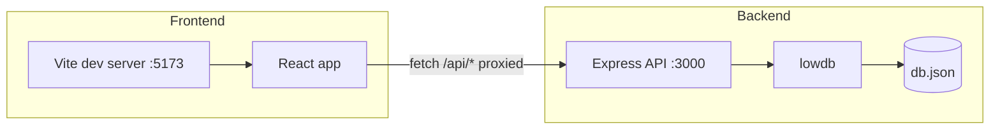

# React + Vite (frontend) and Node + Express (backend) with JSON DB

## Recommended JSON database approach (Feb 2026)

Use **lowdb** (v6+) on the backend:

- **Why**: Mature, widely used, atomic writes to a single `.json` file, simple Promise-based API, works well with TypeScript, and no separate process. Ideal for small-to-medium data, prototyping, and single-instance backends.
- **Where data lives**: e.g. `backend/data/db.json` (gitignored or committed, your choice).
- **Alternative**: If you later need MongoDB-style queries, indexing, or transactions, consider **JsonDB** (e.g. [sinkingsheep/JsonDB](https://github.com/sinkingsheep/jsondb)); for this scaffold, lowdb keeps things simple.

Backend will use a **single JSON file** as the store, with lowdb handling read/write and optional in-memory caching.

---

## High-level structure

```
customer-support-tickets/
├── frontend/          # React + Vite + TypeScript
├── backend/           # Node + Express + TypeScript + lowdb
├── .gitignore
└── README.md
```

---

## 1. Backend (Node.js + Express + TypeScript)

- **Location**: `backend/`
- **Stack**: Node 20+ LTS, Express, TypeScript (ts-node or compiled JS), lowdb.
- **Key files**:
  - `package.json` — scripts: `dev` (ts-node-dev or tsx), `build`, `start` (run compiled).
  - `tsconfig.json` — strict TS, output to `dist/`.
  - `src/index.ts` — create Express app, mount JSON body parser, CORS, and API routes.
  - `src/db.ts` — initialize lowdb with a file adapter pointing to e.g. `data/db.json`; export a typed db instance.
  - `src/routes/` — e.g. one router (e.g. `items.ts` or `tickets.ts`) as a sample resource: GET list, GET by id, POST create, PATCH update, DELETE. Routes read/write via the db instance from `db.ts`.
  - `data/db.json` — initial content (or `tickets: []`)
- **Conventions**: Use `express.json()`, enable CORS for `http://localhost:3000` (Vite default). Keep route handlers thin; put any “business” logic in small service modules if you like.
- **Env**: Optional `.env` in backend (e.g. `PORT=3001`, `DB_PATH=./data/db.json`). Use `dotenv` and read in `index.ts`.

---

## 2. Frontend (React + Vite + TypeScript)

- **Location**: `frontend/`
- **Stack**: Vite 6.x, React 18+, TypeScript, CSS (plain or a minimal utility approach; no heavy UI framework unless you add it later).
- Dev serve Port: 3000
- **Key files**:
  - `package.json` — scripts: `dev`, `build`, `preview`. Dependency: `react`, `react-dom`; devDependency: `@vitejs/plugin-react`, `typescript`, `@types/react`, `@types/react-dom`.
  - `vite.config.ts` — use `@vitejs/plugin-react`; optional `server.proxy` for `/api` → `http://localhost:3001` so the frontend can call the backend without CORS issues in dev.
  - `tsconfig.json` / `tsconfig.node.json` — strict, DOM types.
  - `index.html` at project root (Vite convention) with a root div and script to `src/main.tsx`.
  - `src/main.tsx` — React root render.
  - `src/App.tsx` — top-level component; one simple view that fetches from the backend (e.g. GET list) and displays it, to validate the full stack.
  - Optional `src/api/client.ts` — `fetch` wrapper with `baseURL` for the API (e.g. `/api` when proxied).
- **Conventions**: Use functional components and hooks; keep a single placeholder “resource” (e.g. list + maybe add form) so the pipeline (Vite → proxy → Express → lowdb) is proven.

---

## 3. Cross-cutting

- **.gitignore**: `node_modules/`, `dist/`, `frontend/dist/`, backend `data/db.json` (optional), `.env`, IDE/OS files.
- **README.md**: One-line description; how to run backend (`cd backend && npm install && npm run dev`) and frontend (`cd frontend && npm install && npm run dev`); note that API is at `http://localhost:3001` and frontend at `http://localhost:3000` (or with proxy, `/api` from frontend).

---

## 4. Data flow (summary)




---

## 5. Suggested implementation order

1. **Backend**: Init `package.json`, TS, Express, lowdb, `db.ts`, one sample router (e.g. CRUD for `items` or `tickets`), CORS + optional dotenv.
2. **Frontend**: Init Vite + React + TS, proxy `/api` to backend, one page that GETs the sample resource and renders it.
3. **Root**: Add `.gitignore` and `README.md` with run instructions.

After this, you can replace the sample resource with your real domain (e.g. support tickets, users, etc.) and add more routes and UI as needed.